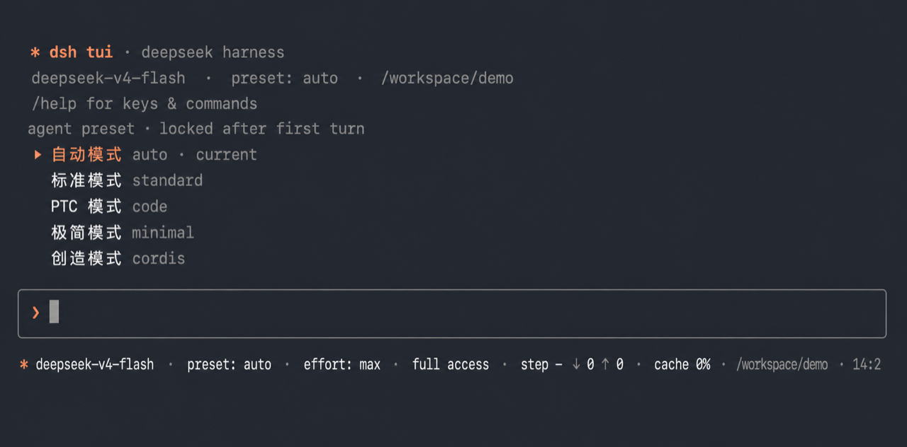

# DSH 轻量 TUI

[English](README.md)

这是一个基于 Node readline 的 DeepSeek Harness 交互式终端 profile bundle。
模型、Agent Preset、会话、权限、命令与工具仍由 DSH 服务负责，本插件提供终端
聊天界面。

这是独立的轻量实现，不是 React/Ink 架构的
[`ccch1mneyyy/dsh-TUI`](https://github.com/ccch1mneyyy/dsh-TUI)。

## 界面预览



图片裁剪自真实的本地 `dsh --profile tui` 启动首屏；已移除终端窗口栏和 shell
历史，并把工作目录匿名化为 `/workspace/demo`。截图不包含用户名、主目录路径、
会话 ID 或个人项目信息。

## 功能

- 流式显示回答、思考、工具调用与工具结果；图片输出与历史使用 Codex 风格的
  `[Image #N]` 占位符。
- 通过可重复的 `--image`/`-i` 启动参数或 `/image` 命令把图片附加到下一条
  prompt；粘贴图片路径时会自动附加，macOS 上按 Ctrl+V 还可以直接读取从 Finder
  或其他应用复制的图片。这里必须按 Control+V，而不是 Command/⌘V：Terminal 不会把
  纯图片的 Command+V 粘贴传给 TUI 进程。待发送图片显示为 `[Image #N]`，图片字节
  保留在 DSH rc.1 的本地附件存储中。发送前会执行与 Web 相同的 rc.1 模型能力预检；当前模型明确
  为纯文本时保留待发送图片，不会启动模型回合。
- TTY 下提供固定边框输入框、命令补全、历史记录与窗口缩放重排；管道输入输出时
  自动退化为普通逐行循环。
- 基于 DSH 持久会话存储的新建、恢复、列表与删除流程。
- 空白会话可选择 Agent Preset；第一次模型回合开始后锁定，不能中途切换。
- 模型与推理强度选择器，Shift+Tab 循环权限 preset。
- 合并 DSH slash-command 注册表和用户可调用的 Skill，并提供显式的
  `!<command>` 本地 shell 快捷方式。
- 可选集成 Guardian：未批准审计使用独立绿色或红色输出块；`a` 原样执行，`e`
  将意见载入输入框，编辑后按 Enter 执行。warning 不取消主 Agent，而是在当前
  tool call 结束后 steering 执行；critical 已暂停，批准后立即执行。暂停时 `c`
  通过 OSC 52 复制反馈。

## 安装

要求 DeepSeek Harness `0.1.1-rc.1` 或兼容的后续版本。

```sh
dsh plugin --profile tui add github:yhfgyyf/dsh-tui-app
dsh --profile tui
```

当 `tui` profile 不存在时，第一条命令会创建它，并把本包作为标准
`dsh.bundle` 写入该 profile。

启动参数：

```sh
dsh --profile tui --help
dsh --profile tui --preset minimal
dsh --profile tui -i diagram.png
dsh --profile tui -i a.png -i b.jpg
dsh --profile tui --resume <session-id>
```

单独安装时默认使用 `standard`。如需新增并默认使用第一条 prompt 自动路由，请在
TUI 之后安装 Auto Router bundle：

```sh
dsh plugin --profile tui add github:yhfgyyf/dsh-auto-preset-router
dsh --profile tui --preset auto
```

如需新增显式的第五种守护模式和持久 Codex 审计，再安装 Guardian bundle。
Guardian 不会成为 Auto Router 的分类目标：

```sh
dsh plugin --profile tui add github:yhfgyyf/dsh-guardian-mode
dsh --profile tui --preset guardian
```

## 命令与按键

本地命令包括 `/help`、`/image`、`/sessions`、`/resume`、`/preset`、`/new`、
`/model`、`/effort` 和 `/exit`。`/image a.png,b.jpg` 会把图片附加到下一条
prompt，`/image clear` 清除待发送图片。`/model` 会列出所有已配置 provider 的模型，
也可用 `/model <provider>/<id>` 切换路由。官方自带的 DeepSeek V4 Flash/Pro 路由是
纯文本的；rc.1 新增官方 `deepseek-v4-flash-vision-exp` 图片模型，发送前应选择该模型
或其他明确声明图片输入能力的路由。当相应 provider 已组装时，`/compact`、
`/goal`、`/feedback`、`/export` 等 DSH 应用命令会从共享注册表自动加入。
Guardian 通过同一注册表增加 `/guardian status|now|history|accept|resume`。

当前 Agent Preset 中允许用户调用的 Skill 也会加入 `/` 菜单。可直接输入
`/skill-name`，或选中后按 Tab 补全为 `/skill-name `，再填写任务并发送。TUI 会把
包含该字面量的 prompt 原样交给 DSH，由官方 `agent/pre-step` 路径注入标准 Skill
内容，行为与 Web 一致。禁止模型调用但允许用户调用的 Skill 会标注为
`user-only`；禁止用户调用的 Skill 不显示。若宿主命令与 Skill 同名，宿主命令优先。

主要按键：Enter 发送，↑/↓ 浏览历史或选择项目，Tab 补全，Shift+Tab 循环权限，
macOS 上按 Control+V（不是 Command/⌘V）粘贴剪贴板图片，Esc 中断或关闭菜单，
Ctrl+L 清屏，Ctrl+D 退出。
Guardian 有待处理审核且输入框为空时，按 `a` 原样执行，或按 `e` 编辑后 Enter
执行（Esc 取消）；暂停时按 `c` 复制最新反馈。`r` 只恢复没有待批准 critical
的失败/手工暂停。

## 安全边界

`!<command>` 是用户主动触发的 shell escape：它会在当前 workspace 中直接启动
用户 shell，**不会**经过 Agent 工具沙箱或审批策略。只应执行你信任的命令。
模型使用的普通 shell 工具仍由当前 DSH preset 与权限设置管理。

与其他 DSH 插件一样，本插件代码拥有 DSH 进程本身的权限。

## 卸载

如果同一 profile 安装了 Auto Router，请先卸载它：

```sh
dsh plugin --profile tui remove dsh-auto-preset-router
dsh plugin --profile tui remove dsh-tui-app
```

卸载不会删除 `$DSH_HOME` 下的会话数据。

## 开发与验证

```sh
npm test
npm run check
npm run pack:check
```

仓库采用当前 DSH 插件分发规范：`package.json` 声明
`dsh.bundle.patch`，由 `cordis.patch.yml` 通过
`dsh plugin --profile … add …` 组装。
